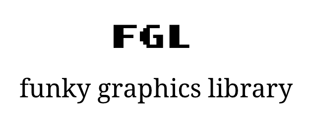
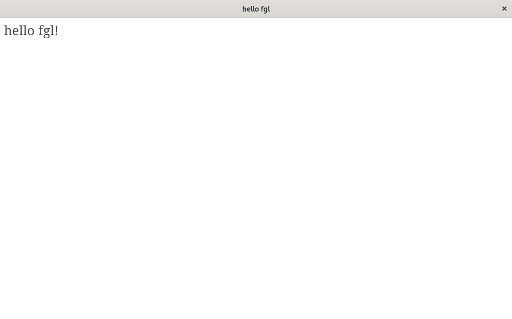

# Funky Graphics Library
a library inspired by raylib to get working with OpenGL easily

## features
- easy and simple to understand
- create windows easily
- keyboard and mouse input
- shapes drawing such as pixels, triangles, lines and rectangles
- easy sprite rendering and loading
- easy text drawing and font loading

## building and installing library
for now it's only available as a shared library and for Linux. I'll be working on cross-platform compatibility.
```
git clone https://github.com/mrfundkdude/fgl.git
cd fgl/src
chmod 700 install.sh
make && sudo ./install
```

## example application
this example will create a blank window with a text that says "hello fgl!"
```
#include "fgl.h"

int main()
{
    fgl_open_window(1024, 600, "hello fgl");
    fgl_font fnt = fgl_load_font("res/font.ttf");

    while (!fgl_is_window_closed()) {
        fgl_start_drawing();
        fgl_set_background(FGL_WHITE);
        fgl_draw_text(fnt, "hello fgl!", 10, 10, 30, FGL_DARKGRAY);
        fgl_stop_drawing();
    }

    fgl_close_window();
    return 0;
}
```
once installed the library, run the following command
```
gcc your_source.c -lFGL -o your_binary
```
